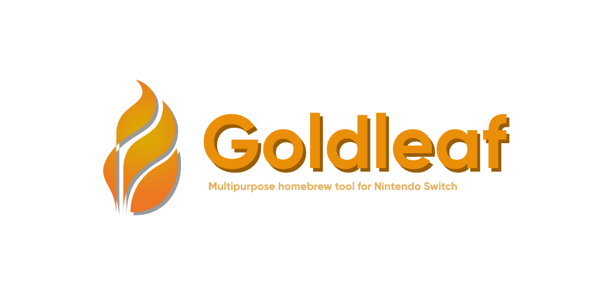
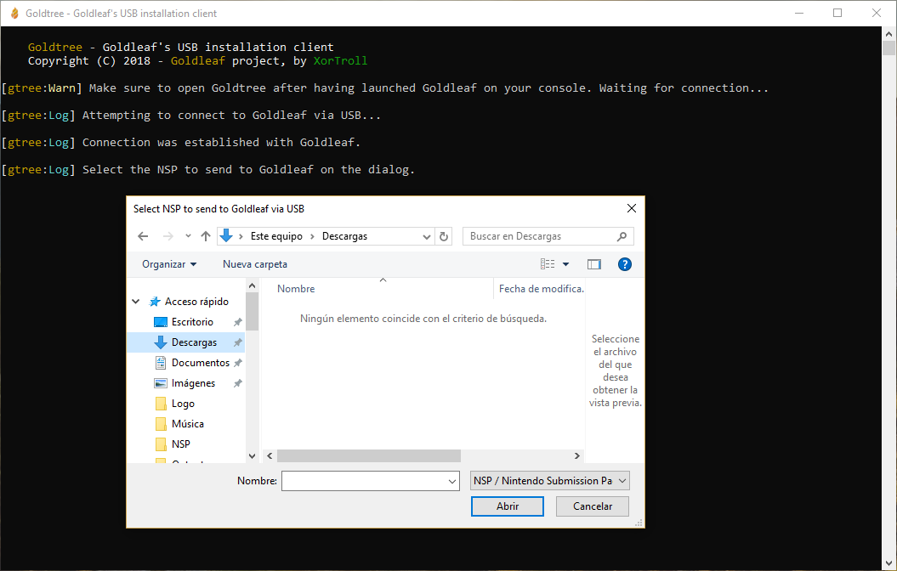
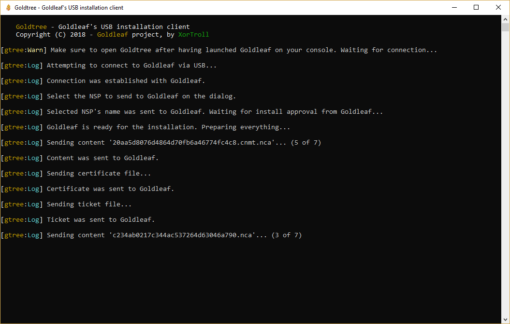

# Goldleaf

> Easy-to-use title installer & manager for Nintendo Switch

- **If you are looking for Tinfoil, this is Tinfoil's safer and way more extended evolution.**

## Brief description

Goldleaf is a multipurpose tool, specialized on title installing from NSP packages, but with other utilities, such as NAND/SD browsing, 

You can easily manage title-related stuff, like install titles via NSP packages or uninstall already installed titles.

If you know what FBI is (related to 3DS homebrew), this is a similar project for Nintendo Switch.

## Disclaimer

Installing NSP packages can be dangerous.

Keep in mind that there will always be a ban risk, and that NSPs with tickets are specially dangerous.

If you want to be safe, avoid connecting to the internet via airplane mode, or block Nintendo's services via special tools such as 90DNS.

Goldleaf simply provides support for a normal NSP and/or ticket installation. The way you use them or the risks you are taking are your problem.

Goldleaf gives the user the possibility to modify NAND files, by deleting them or allowing to copy new files there.

This can be dangerous, as deleting NCAs from the NAND contents can lead to unfixable errors. Image deleting all the EXE and DLL files from System32 folder. Well, the result would be similar.

Removing tickets from installed contents will make the system not to be able to recognise them as "legit" purchased, so it will refuse to launch them (in many cases, but NOT all cases)

## Main features

- **SD card and NAND browser**

  A very simple but, in my opinion, one of the most useful features in Goldleaf. Just a file browser for the SD card or for NAND partitions, providing special support for some file formats:

  - **NSP (Nintendo Submission Package)**
  
    It's the official format used by Nintendo to provide installable content from their CDN servers.

    Technically, it's a PFS0 (a simple file format containing several files) with NCA contents, sometimes XML and/or icon metadata (exported by official packaging tools), and a ticket and a cert in case they are signed with a titlekey (games are, system contents aren't).

    Goldleaf can install NSPs same way other official apps would, like DevMenu.

    As a warning, I do not recommend installing NSPs in case you plan to go online. Installing content from unofficial tools (such as Goldleaf or the old Tinfoil) can lead to permanent bans from online services, and in severe cases, from every Nintendo service, even from updating the console or games. Install NSPs at your own risk.

  - **NRO (Nintendo Relocatable Object)**

    Officially is treated as a dynamic library object, similar to DLLs on Windows. This are loaded dynamically by applications at runtime.

    Homebrew uses them as executable binaries because as they can contain multiple data sections, we can use them to load extra info such as NACP (title, author and version), an icon, or even RomFs data to access at runtime.

    Goldleaf has the ability of launching NROs located at the SD card. Keep in mind that this feature usually can cause undefined behavior due to some difficulties cleaning up graphics so quickly.

  - **NCA (Nintendo Content Archive)**

    This format is the base format used by Horizon OS to store content.

    While the previously mentioned formats don't require any kind of cryptography to be extracted or used, NCAs have to be decrypted, so the user is required to provide the required keys to extract the content.

    NCAs have different sections, as well as other information. The two main sections are the ExeFs and RomFs: the ExeFs filesystem contains the code NSO binaries and a NPDM metadata file, while the RomFs contains different files to be accessed from the title.

    Some NCAs could also contain a special section, which is the section 0. This section contains the PNG and GIF logos displayed at the top-left and botton-right of the console when launching a title.

    NCAs don't have neccessarily those two sections. The program NCA, the base of any application or applet, will contain an ExeFs, and usually a RomFs in case it's a game or a system title with resources like settings or Home Menu.

    Appart from program NCAs there are some other NCA types: control NCA (NACP and icons), legalinfo NCA (HTML manuals and information), offline NCA (HTML documents in case the title wants to load them) content meta CNMT NCA (with title specific information)...

    Goldleaf has embedded hactool in his code, so it can extract those partitions from NCAs, if the keys are provided.

  - **NXTheme (Home Menu theme)**

    This format is developed by Qcean team, a format to handle Home Menu layout modding.

    +Goldleaf can install them, but it needs to have Home Menu's RomFs at `sd:/goldleaf/qlaunch`. If the keys used with other formats are provided, Goldleaf itself will locate the console's qlaunch and extract it to that directory.

    You will have to reboot with CFW after installing a theme to see any changes.

  - **NACP (Nintendo Application Control Property)**

    This is the format used by Nintendo to store a title's name, version, author name and other information, like if the title supports screnshots or video captures.

    Goldleaf can parse a NACP file and display some of it's information.

  - **Tickets and certificates**

    Tickets (.tik) and certificates (.cert) are the format used by Nintendo to provide encryption data for titlekey-signed titles (almost every game).
    
    NSPs usually contain them, and Goldleaf can install them if they are located in the SD card.

    To install a ticket you will have to provide a certificate, both with the same name and in the same directory, with their extension. (example: `sd:/game.tik` and `sd:/game.cert`)

  The NAND browser has almost the same support, but it's reccomended to use it only to export files via copying them to the SD card, to avoid any trouble. Goldleaf should warn when doing dangerous operations anyway.

- **USB installer and Goldtree**

  You can install NSPs via USB using Goldtree, a C# PC client to handle this installations.

  Keep in mind that USB installations are a bit unstable, and might bug sometimes.

- **Title manager**

  Goldleaf's title manager will display all the titles installed in the system, both SD, NAND and the one in the gamecart if inserted.

  You can view these titles' information, icon, install location and Application Id.

  Titles can also be completely uninstalled here. Keep in mind that deleting a title won't delete its savedata, that should stay on the system.

- **Ticket manager**

  Goldleaf can get all the tickets installed on the console. While some of them will contain the name of the title they belong to, some could belong to DLC or other types of content despite not belonging directly to a title.

  You can view the Application Id and the key generation of a ticket by selecting it.

  Tickets can also be removed from the console. Removing tickets can be a dangerous option, as without them, titlekey-signed won't be allowed to boot by Home Menu.

- **CFW configuration**

  This is mostly a useful menu for checking which CFWs are in the SD card and whichof them have any Home Menu modifications, meaning that a theme is probably installed there.

  You can delete any Home Menu modifications of a certain CFW after selecting a CFW.

- **Console information**

  On this option, you can check the used size of the SD card, the entire NAND, and on the different NAND partitions.

  It also displays the current firmware version the console is.

- **About**

  Displays Goldleaf's logo and whether Goldleaf is running as a NRO from hbmenu or as a normal title.

As some other miscellaneous options, you can easily reboot or shut down your console from Goldleaf, by pressing ZL or ZR in any moment.

### Providing keys

If you provide a file with several Switch keys (commonly named as `prod.keys` or `keys.dat`) you will be able to do some extra stuff with Goldleaf: (remember that you have to place it as `sd:/goldleaf/keys.dat`)

- Unless you already have dumped qlaunch's (aka Home Menu) RomFs (or at least the files within `lyt` folder) in `sd:/goldleaf/qlaunch` directory, you will need to provide the previously mentioned key file with several keys, so that Goldleaf can extract directly the RomFs of the console's qlaunch contents to use it.

- You have the option to extract NCA contents (ExeFs, RomFs or section 0), but you will need the previously mentioned keys too.

## Installation

You have two options to use Goldleaf: load it as **regular homebrew via hbmenu** as a **NRO** binary, or install the **NSP** as a **regular title**. Ironically, you would need to install Goldleaf's NSP via Goldleaf as a NRO (or older installers like the original Tinfoil)

For both options, you will have to get the latest release of the **NRO**/**NSP** from [here](https://github.com/XorTroll/Goldleaf/releases).

### Getting ready for USB installations

USB installations require a few extra things to be available:

- Download Zadig tool from [here](https://zadig.akeo.ie/)

- Open Goldleaf and select the USB install option, with the Switch connected to the PC via a USB-C cable.

- Open Zadig, and select the device of your Nintendo Switch, and install libusbK there.

Nothing else is required. No external files, or extra configuration are required for Goldleaf but the NRO/NSP.

- **NRO** binary

  Simply place the NRO anywhere in the SD card (people use to place NROs in `switch` folder) and launch it!

- **NSP** (installable title)

  Goldleaf's NSP title has application ID / title ID `050032A5CF12E000`. (as an extra piece of information)

  You need a homebrew to install the NSP. The best solution would be to download both the NRO and the NSP, and install the NSP via the NRO. (ironically)

  Having it installed, you should be able to launch Goldleaf as a normal title.

## Goldtree and USB installs

USB communication is slightly different from Tinfoil's one, so Tinfoil's old Python script, AluminumFoil nor other tools won't work properly.

Goldtree will ask you to choose a NSP after establishing connection with Goldleaf, and it will be received and installed by Goldleaf.

Keep in mind that USB support is a bit unstable, and sometimes it might fail. Anyway, it should work most of the times.

## Basic controls

The controls are quite intuitive in Goldleaf, but here you have a brief explanation of them:

- Press **A** to select options from menus, browse folders, or in case it's a file, to browse a menu with file options (copy, delete...)

- Press **B** to cancel a dialog or to go back to the previous page / menu.

- Press **X** to paste the path of the clipboard. Obviously, this option is only available on file browsers. (SD or NAND)

- Press **Y** to browse a menu with directory options, similar to the one used with files, instead of browsing the directory. Obviously, this option is only available on file browsers. (SD or NAND)

- Press **ZL** or **ZR** anywhere to browse a menu with reboot / shut down options, in case you want to reboot or shut down the console.

- Press **Plus (+)** or **Minus (-)** to exit Goldleaf and return to hbmenu. This option is only available if Goldleaf is loaded as a NRO binary. (more special cases like this one below)

- Movement is quite obvious. Using the **L-stick**, the **R-stick** or the **D-pad** you can move through menu or dialog options. On menus (like the file browsers or the main menu) the **R-stick** provides a way faster scrolling.

## Special features

Goldleaf differs on some features depending on whether it is loaded as a NRO or as an installed title:

- Goldleaf can be exited via **Plus (+)** or **Minus (-)** buttons if it's loaded as a NRO, but as regular titles have to be exited from the Home Menu, this feature is not available as a title.

- Goldleaf disables **Home button pressing** while installing a NSP if it's loaded as a title, but this feature isn't available as a NRO binary for technical reasons related to applets.

- Goldleaf cannot launch NRO binaries if it's loaded as a title due to technical reasons. They can only be launched from another NRO binary.

## Issues and support

In case you find a bug or you need help with Goldleaf, you have several places to ask.

Many errors are very common and can be misunderstood, and you should document a bit for some errors instead of directly calling them issues:

- It's a common issue for some NSPs, although they are completely valid ones, being detected as wrong NSPs. Although they can be really wrong NSPs, it is usually caused by firmware mismatch. For instance, in case you are trying to install a title which requires at least 5.1.0 version (which uses key generation 4) on a lower firmware version, it won't be recognised as a valid NSP for cryptographical reasons. (the console cannot decrypt the NSP because it is encrypted with unknown keys which are within 5.1.0 update)

- The USB installation can sometimes freeze in the middle of the install. If that happens, try closing Goldleaf and Goldtree, uninstalling the wrongly-installed title and retrying.

## Screenshots

- Goldleaf

- Goldtree

## Possible future features

- Savedata mounting and browsing (and hopefully exporting)

- Key derivation, the process to obtain the required keys from the console itself

- Support more extraction formats (PFS0 (aka NSP) or XCI), same way GodMode9 does with the 3DS system

- As GodMode9 does, implement a more simple way to mount contents instead of static menus

## Credits

The main conceps of Goldleaf are and have been developed by XorTroll, but without the effort and support of many others, this project wouldn't be what it is now:

(from all the people listed below, special thanks to Adubbz, exelix, C4Phoenix, The-4n and SciresM, for their huge support on their respective areas of homebrew)

- Adubbz and all the (old) [Tinfoil](https://github.com/Adubbz/Tinfoil) contributors, for their huge work with title installing.

- exelix and Qcean team, for all their huge support with Home Menu themes. Goldleaf uses (adapted) [SwitchThemesCommon](https://github.com/exelix11/SwitchThemeInjector) libraries to handle theme installs.

- C4Phoenix, for his awesome work doing this project's logo, and the GIF displayed when launching the installed version.

- All the icons except Goldleaf's one (see credit above) were grabbed from [Icons8](https://icons8.com).

- The-4n, for [hacBrewPack](https://github.com/The-4n/hacBrewPack), to make completely legal NSPs.

- SciresM for [hactool](https://github.com/SciresM/hactool), which was ported as a library to make NCA extraction a thing in Goldleaf.

- Thealexbarney, for his C# libraries for various Nintendo Switch formats: LibHac, used by Goldtree.

- Simon for his libusbK implementation for C#, which has made Goldtree client possible.

- All the testers, for reporting bugs and helping with the project's development.

## Support

If you would like to be more informed about my projects' status and support, you should check [H&H](https://discord.gg/3KpFyaH), my Discord server. It's a simple server for Homebrew and Hacking, focused on my projects. If you would like to be a beta-tester, you might be interested on the nightly building system we have there for testers.

If you like my work, you should take a look at my [Patreon](https://patreon.com/xortroll) page. For those who support me, you will be credited on my projects, and you'll gain some nice extras on H&H!
